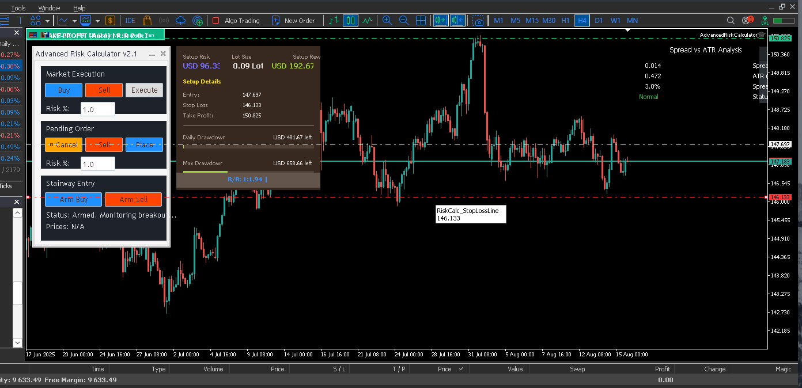

# Advanced Risk Calculator EA for MetaTrader 5

The Advanced Risk Calculator is a comprehensive trade management Expert Advisor for MetaTrader 5. It is designed to provide traders with precise risk control, streamlined trade execution, and powerful tools to successfully navigate the challenges of proprietary trading firms (prop firms).

This EA is built on a highly modular and robust architecture, featuring a clean separation of logic for UI, trade execution, and risk management. It also includes a suite of unit tests to ensure the reliability of its core financial calculations.

### 🖼️ Screenshots

* The on-chart control panel
* Lot size calculation in action
* Example of market vs pending order setup

---

## ✨ Key Features

-   [cite_start]**Precise Lot Sizing**: Automatically calculates the correct lot size based on a percentage of the account balance or a fixed monetary amount[cite: 74].
-   **Multiple Execution Modes**:
    -   [cite_start]**Market Execution**: Enter trades instantly at the current market price[cite: 67].
    -   [cite_start]**Pending Orders**: Set up limit or stop orders with precision[cite: 67].
    -   [cite_start]**Stairway Entry**: A unique, multi-step entry strategy for breakout confirmation[cite: 67].
-   **Advanced Prop Firm Guardian**: A dedicated module to help you stay within the rules of prop firm challenges.
    -   [cite_start]Monitors real-time daily and maximum drawdown limits[cite: 103, 104].
    -   [cite_start]Supports both **Static** and **Trailing** drawdown models[cite: 108].
    -   [cite_start]**Pre-Trade Safety Check**: Simulates the worst-case scenario *before* placing a trade to prevent potential rule violations[cite: 140].
    -   [cite_start]Persists account state between platform restarts to maintain accurate tracking[cite: 631].
-   **Modern & Informative UI**:
    -   [cite_start]A main control panel for initiating trades[cite: 378].
    -   [cite_start]A graphical **Display Canvas** that shows live P/L, open risk, and prop firm rule metrics[cite: 304, 516].
    -   [cite_start]A **Spread vs. ATR Analysis** panel to gauge market conditions and trading costs in real-time[cite: 199].
-   [cite_start]**Dynamic R:R Lines**: Automatically calculates and adjusts the Take Profit line based on a specified Risk-to-Reward ratio[cite: 75].

---

## ⚙️ Installation & Setup

1.  **Download the Project**: Clone or download the repository to your local machine.
2.  **Open MetaEditor**: In your MT5 terminal, go to `Tools > MetaQuotes Language Editor`.
3.  **Copy Files**: In the MetaEditor's Navigator panel, right-click on the `Experts` folder and select `Open Folder`. Copy all the project files (`.mq5` and `.mqh`) into this directory. It is recommended to keep them in a subfolder (e.g., `MQL5\Experts\AdvancedRiskCalculator\`) to maintain the project structure.
4.  **Compile the EA**: In MetaEditor, open the main `AdvancedRiskCalculator.mq5` file and press `F7` or click the `Compile` button.
5.  **Attach to Chart**: In your MT5 terminal, find the "AdvancedRiskCalculator" EA in the Navigator under the `Expert Advisors` section. Drag and drop it onto the chart of your choice.
6.  **Enable Algo Trading**: Ensure the "Allow Algo Trading" button is enabled in the EA's input settings and on your MT5 terminal toolbar.

---

## 🔧 Configuration (Input Parameters)

The EA's behavior can be customized through the following input parameters found in `Defines.mqh`:

#### Risk & Safety Settings
-   [cite_start]`InpRiskMode`: Choose the basis for risk calculation: `RISK_PERCENT` or `RISK_MONEY`[cite: 74].
-   [cite_start]`InpRiskPercent`: The risk percentage of your account balance to use if `RISK_PERCENT` mode is active[cite: 71].
-   [cite_start]`InpMaxMarginUsagePercent`: A safety feature that prevents a trade from consuming more than a specified percentage of your free margin[cite: 73].

#### Take Profit Settings
-   [cite_start]`InpTPMode`: Set the Take Profit mode to `TP_MANUAL` or `TP_RR_RATIO`[cite: 75].
-   [cite_start]`InpTP_RR_Value`: The desired Risk-to-Reward ratio (e.g., `2.0` for a 1:2 R:R) when `TP_RR_RATIO` mode is active[cite: 75].

#### Stairway Entry Settings
-   [cite_start]`InpStairwayInitialPercent`: The percentage of the total lot size to use for the first entry step in the Stairway strategy[cite: 69].

#### Prop Firm Rules
-   [cite_start]`InpEnablePropRules`: Set to `true` to activate the Prop Firm Guardian module[cite: 103].
-   [cite_start]`InpMaxDailyDrawdownPercent`: The maximum allowed daily loss percentage[cite: 104].
-   [cite_start]`InpMaxOverallDrawdownPercent`: The maximum allowed overall loss percentage[cite: 104].
-   [cite_start]`InpDailyDDBase`: The basis for calculating daily drawdown: from the day's starting `DD_FROM_BALANCE` or `DD_FROM_EQUITY`[cite: 107].
-   [cite_start]`InpOverallDDType`: The type of maximum drawdown calculation: `DD_TYPE_STATIC` (based on initial balance) or `DD_TYPE_TRAILING` (based on peak equity)[cite: 108].

---

## 🧠 Core Concepts Explained

#### Prop Firm Guardian
This is more than just a display. [cite_start]Before any new trade is sent to the server, the EA performs a critical simulation[cite: 140]. It calculates the total potential loss if the new trade *and* all other currently open positions were to hit their stop losses simultaneously. If this combined loss would violate the daily or maximum drawdown rules, the trade is automatically rejected, protecting your account from a breach.

#### Stairway Entry Strategy
[cite_start]This is an advanced entry protocol designed to avoid false breakouts[cite: 260].
1.  **Monitor**: The EA waits for the price to break a user-defined "Breakout" line.
2.  **Arm**: Once broken, it places an initial pending (limit) order with a partial lot size at a "Pullback Entry" line.
3.  **Confirm**: It then waits for the breakout candle to close.
4.  **Execute**:
    -   **Ideal Scenario**: If the candle closes confirming the breakout and the initial order is filled, it places a second pending order for the remaining lot size.
    -   **Corrective Scenario**: If the candle confirms but the price did not pull back to fill the first order, the EA cancels the initial order and places a new, full-sized pending order.
    -   **Fakeout Scenario**: If the candle closes *against* the breakout direction, the EA cancels the pending order to prevent a bad entry.

---

## ⚠️ Strategic Warning: Hidden Stop Loss Risk

[cite_start]The **Stairway Entry Strategy** utilizes a **hidden stop loss** managed by the `ManageStairwayHiddenSL` function[cite: 294]. This means the stop loss order is NOT placed on the broker's server; instead, the EA monitors the price and closes the position locally if the stop level is hit.

**Be aware of the inherent risks:**
> If you lose your internet connection, your MetaTrader 5 terminal crashes, or your VPS fails, the hidden stop loss **will not execute**. Your position will be left unprotected without a server-side SL. Please ensure you have a stable connection and reliable hosting when using this strategy.

---

## 💻 Development & Testing

This Expert Advisor is built with a focus on quality and reliability.
-   **Modular Architecture**: The code is cleanly separated into logical units (`.mqh` files) for easy maintenance and extension.
-   **Unit Tested**: The core logic, including lot size calculation and prop firm safety checks, is validated by an automated test suite (`TestRunner.mq5`), ensuring that the financial calculations are accurate and behave as expected.

## 🤝 Contributing

Contributions are welcome! If you find a bug or have a feature request, please open an issue in the repository using the provided `issue_template.md`.

## 📜 License

This project is licensed under the **GNU General Public License v3.0**. See the `LICENSE` file for more details.
