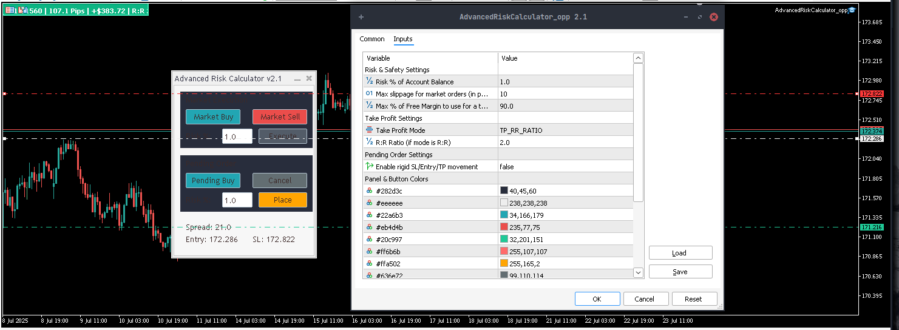

# 🔐 Advanced Risk Calculator for MetaTrader 5

An intuitive and powerful Expert Advisor for MetaTrader 5 designed to simplify **risk management** and enhance **trade execution**. It features a modern, on-chart control panel that helps you calculate position sizes automatically and place market or pending orders with precision — all in just a few clicks.

### 🖼️ Screenshots

Include screenshots of:

* The on-chart control panel
* Lot size calculation in action
* Example of market vs pending order setup

---

🌐 [English](#english) | [فارسی (Persian)](#فارسی-persian)

---

## 🌍 English

### Overview

**Advanced Risk Calculator** is a lightweight yet powerful trading assistant built for MT5. It removes the hassle of manual lot size calculations and reduces the risk of costly errors. Simply place your Entry and Stop Loss levels visually on the chart, and the panel instantly calculates the correct lot size based on your selected risk percentage.

This tool allows you to focus on your **strategy**, not your calculator.

---

### 🔑 Features

* **🔢 Risk-Based Lot Size Calculation**
  Automatically calculates position size based on your account balance and defined risk %.

* **🛒 Market & Pending Orders**
  Easily place Market (instant execution) or Pending (Stop/Limit) orders.

* **📈 Interactive Chart Elements**
  Drag horizontal lines to set Entry, SL, and TP levels directly on the chart.

* **⏱️ Real-Time Calculations**
  The panel shows:

  * Suggested lot size
  * Risk value (in account currency)
  * Risk-to-Reward ratio (R\:R)
  * Distance in pips for SL/TP

* **🧑‍💻 Modern UI**
  Built with the MQL5 standard library for a clean and responsive user experience.

* **⚙️ Fully Customizable**
  Adjust input parameters like risk %, default R\:R ratio, and panel appearance.

---

### 🛠 Installation

1. Download `AdvancedRiskCalculator_v2.ex5` (compiled) or the source files: `.mq5` and `.mqh`.
2. Open MetaTrader 5.
3. Go to `File -> Open Data Folder`.
4. Navigate to `MQL5 -> Experts`.
5. Copy the downloaded file(s) into this folder.
6. In MT5, right-click the “Expert Advisors” section in the Navigator, then click **Refresh**.
7. “Advanced Risk Calculator” will now appear in your list.

---

### 🚀 How to Use

#### ✔️ For Market Orders

1. Drag the EA onto your chart.
2. Make sure “Algo Trading” is enabled.
3. Click **Market Buy** or **Market Sell**.
4. Entry price will be fixed to the current market.
5. Drag the red SL line to your desired level.
6. Lot size and risk will update automatically.
7. Click **Execute** to place the order.

#### ⏳ For Pending Orders

1. Click **Pending Buy** or **Pending Sell**.
2. Drag Entry, SL, and TP lines to your desired prices.
3. The panel updates all values in real-time.
4. Click **Place** to send the order.

> To cancel an operation at any point, click the **Cancel** button.

---

### 🧪 Demo Testing Recommended

Before using this EA on a live account, it is **strongly recommended** to test it thoroughly on a **demo account**. This helps you become familiar with its behavior, controls, and performance under different market conditions — without risking real capital.

---

### ⚠️ Risk Warning

Trading in financial markets involves substantial risk and is not suitable for all investors. This tool is designed to assist with risk management but **does not eliminate the possibility of loss**. Use with caution and always trade responsibly.

---

### 📄 License

This project is licensed under the **GNU General Public License v3.0 (GPL-3.0)**. See the `LICENSE` file for details.

---

## 🇮🇷 فارسی (Persian)

### مرور کلی

**اکسپرت Advanced Risk Calculator** یک دستیار معاملاتی قدرتمند و آسان برای متاتریدر ۵ است که شما را از محاسبه دستی حجم معامله بی‌نیاز کرده و خطای انسانی را به حداقل می‌رساند. تنها با مشخص کردن نقاط ورود و حد ضرر روی نمودار، حجم لات متناسب با درصد ریسک انتخابی شما فوراً محاسبه می‌شود.

این ابزار به شما اجازه می‌دهد تا به‌جای محاسبات پیچیده، بر روی **استراتژی معاملاتی** خود تمرکز کنید.

---

### ✨ ویژگی‌ها

* **محاسبه خودکار حجم معامله بر اساس ریسک**
  محاسبه حجم مناسب بر اساس درصد مشخصی از بالانس حساب.

* **پشتیبانی از سفارشات Market و Pending**
  امکان اجرای سفارشات فوری یا شرطی (Stop / Limit).

* **خطوط تعاملی روی نمودار**
  خطوط افقی قابل‌جابجایی برای تعیین بصری Entry، SL و TP.

* **محاسبات لحظه‌ای و دقیق**
  شامل:

  * حجم لات پیشنهادی
  * ارزش ریسک (بر اساس ارز حساب)
  * نسبت ریسک به ریوارد (R\:R)
  * فاصله SL/TP به پیپ

* **رابط کاربری مدرن و حرفه‌ای**
  طراحی شده با استفاده از کتابخانه رسمی MQL5.

* **قابلیت شخصی‌سازی بالا**
  تغییر تنظیماتی مانند درصد ریسک، نسبت R\:R و رنگ پنل از طریق پارامترهای ورودی.

---

### ⚙️ نصب و راه‌اندازی

1. فایل‌های `AdvancedRiskCalculator_v2.ex5` (کامپایل‌شده) یا نسخه‌های سورس `.mq5` و `.mqh` را دانلود کنید.
2. متاتریدر ۵ را باز کرده و به مسیر `File -> Open Data Folder` بروید.
3. وارد پوشه `MQL5 -> Experts` شوید.
4. فایل‌های دانلودشده را در این پوشه کپی کنید.
5. در پنجره Navigator روی "Expert Advisors" کلیک راست کرده و گزینه **Refresh** را انتخاب کنید.
6. اکنون “Advanced Risk Calculator” در لیست قابل مشاهده است.

---

### 🚀 نحوه استفاده

#### 📌 برای سفارش‌های Market:

1. اکسپرت را روی نمودار خود بکشید.
2. مطمئن شوید گزینه "Algo Trading" فعال است.
3. روی Market Buy یا Market Sell کلیک کنید.
4. قیمت ورود روی قیمت فعلی بازار قفل می‌شود.
5. خط SL را به موقعیت دلخواه بکشید.
6. حجم و ریسک به‌صورت آنی محاسبه می‌شوند.
7. در صورت تأیید، روی **Execute** کلیک کنید.

#### 🕒 برای سفارش‌های Pending:

1. روی Pending Buy یا Pending Sell کلیک کنید.
2. خطوط Entry، SL و TP را به قیمت‌های مورد نظر بکشید.
3. مقادیر پنل به‌صورت لحظه‌ای به‌روزرسانی می‌شوند.
4. روی **Place** کلیک کنید.

> برای لغو عملیات در هر زمان، دکمه **Cancel** را بزنید.

---

### 🧪 پیشنهاد تست در حساب دمو

پیشنهاد می‌شود قبل از استفاده از این اکسپرت در حساب واقعی، ابتدا آن را در یک **حساب دمو** تست و بررسی نمایید. این کار به شما کمک می‌کند تا با نحوه عملکرد و رابط گرافیکی آن در شرایط مختلف بازار آشنا شوید — بدون به‌خطر انداختن سرمایه واقعی.

---

### ⚠️ هشدار ریسک

معامله در بازارهای مالی دارای ریسک بالاست و برای همه افراد مناسب نیست. این ابزار تنها یک دستیار در مدیریت ریسک است و **هیچ تضمینی در سودآوری یا جلوگیری از ضرر ندارد**. لطفاً با دانش کامل و مسئولیت‌پذیری معامله کنید.

---

### 📄 مجوز

این پروژه تحت مجوز **GNU GPL نسخه ۳ (GPL-3.0)** منتشر شده است. برای جزئیات بیشتر به فایل `LICENSE` مراجعه نمایید.
